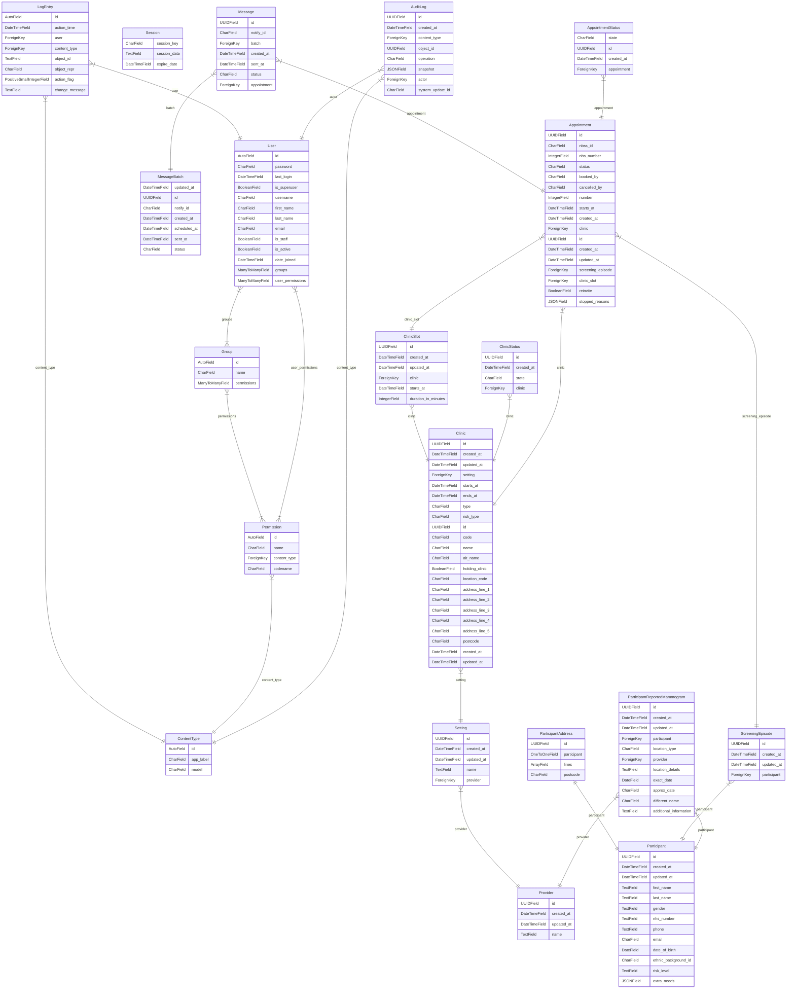

```mermaid
---
Django ER Diagram
---
erDiagram
LogEntry {
    AutoField id
    DateTimeField action_time
    ForeignKey user
    ForeignKey content_type
    TextField object_id
    CharField object_repr
    PositiveSmallIntegerField action_flag
    TextField change_message
}
Permission {
    AutoField id
    CharField name
    ForeignKey content_type
    CharField codename
}
Group {
    AutoField id
    CharField name
    ManyToManyField permissions
}
User {
    AutoField id
    CharField password
    DateTimeField last_login
    BooleanField is_superuser
    CharField username
    CharField first_name
    CharField last_name
    CharField email
    BooleanField is_staff
    BooleanField is_active
    DateTimeField date_joined
    ManyToManyField groups
    ManyToManyField user_permissions
}
ContentType {
    AutoField id
    CharField app_label
    CharField model
}
Session {
    CharField session_key
    TextField session_data
    DateTimeField expire_date
}
AuditLog {
    UUIDField id
    DateTimeField created_at
    ForeignKey content_type
    UUIDField object_id
    CharField operation
    JSONField snapshot
    ForeignKey actor
    CharField system_update_id
}
Provider {
    UUIDField id
    DateTimeField created_at
    DateTimeField updated_at
    TextField name
}
Setting {
    UUIDField id
    DateTimeField created_at
    DateTimeField updated_at
    TextField name
    ForeignKey provider
}
Clinic {
    UUIDField id
    DateTimeField created_at
    DateTimeField updated_at
    ForeignKey setting
    DateTimeField starts_at
    DateTimeField ends_at
    CharField type
    CharField risk_type
}
ClinicSlot {
    UUIDField id
    DateTimeField created_at
    DateTimeField updated_at
    ForeignKey clinic
    DateTimeField starts_at
    IntegerField duration_in_minutes
}
ClinicStatus {
    UUIDField id
    DateTimeField created_at
    CharField state
    ForeignKey clinic
}
MessageBatch {
    DateTimeField updated_at
    UUIDField id
    CharField notify_id
    DateTimeField created_at
    DateTimeField scheduled_at
    DateTimeField sent_at
    CharField status
}
Message {
    UUIDField id
    CharField notify_id
    ForeignKey batch
    DateTimeField created_at
    DateTimeField sent_at
    CharField status
    ForeignKey appointment
}
Appointment {
    UUIDField id
    CharField nbss_id
    IntegerField nhs_number
    CharField status
    CharField booked_by
    CharField cancelled_by
    IntegerField number
    DateTimeField starts_at
    DateTimeField created_at
    ForeignKey clinic
}
Clinic {
    UUIDField id
    CharField code
    CharField name
    CharField alt_name
    BooleanField holding_clinic
    CharField location_code
    CharField address_line_1
    CharField address_line_2
    CharField address_line_3
    CharField address_line_4
    CharField address_line_5
    CharField postcode
    DateTimeField created_at
    DateTimeField updated_at
}
Participant {
    UUIDField id
    DateTimeField created_at
    DateTimeField updated_at
    TextField first_name
    TextField last_name
    TextField gender
    TextField nhs_number
    TextField phone
    CharField email
    DateField date_of_birth
    CharField ethnic_background_id
    TextField risk_level
    JSONField extra_needs
}
ParticipantAddress {
    UUIDField id
    OneToOneField participant
    ArrayField lines
    CharField postcode
}
ScreeningEpisode {
    UUIDField id
    DateTimeField created_at
    DateTimeField updated_at
    ForeignKey participant
}
Appointment {
    UUIDField id
    DateTimeField created_at
    DateTimeField updated_at
    ForeignKey screening_episode
    ForeignKey clinic_slot
    BooleanField reinvite
    JSONField stopped_reasons
}
AppointmentStatus {
    CharField state
    UUIDField id
    DateTimeField created_at
    ForeignKey appointment
}
ParticipantReportedMammogram {
    UUIDField id
    DateTimeField created_at
    DateTimeField updated_at
    ForeignKey participant
    CharField location_type
    ForeignKey provider
    TextField location_details
    DateField exact_date
    CharField approx_date
    CharField different_name
    TextField additional_information
}
LogEntry }|--|| User : user
LogEntry }|--|| ContentType : content_type
Permission }|--|| ContentType : content_type
Group }|--|{ Permission : permissions
User }|--|{ Group : groups
User }|--|{ Permission : user_permissions
AuditLog }|--|| ContentType : content_type
AuditLog }|--|| User : actor
Setting }|--|| Provider : provider
Clinic }|--|| Setting : setting
ClinicSlot }|--|| Clinic : clinic
ClinicStatus }|--|| Clinic : clinic
Message }|--|| MessageBatch : batch
Message }|--|| Appointment : appointment
Appointment }|--|| Clinic : clinic
ParticipantAddress ||--|| Participant : participant
ScreeningEpisode }|--|| Participant : participant
Appointment }|--|| ScreeningEpisode : screening_episode
Appointment }|--|| ClinicSlot : clinic_slot
AppointmentStatus }|--|| Appointment : appointment
ParticipantReportedMammogram }|--|| Participant : participant
ParticipantReportedMammogram }|--|| Provider : provider
```
